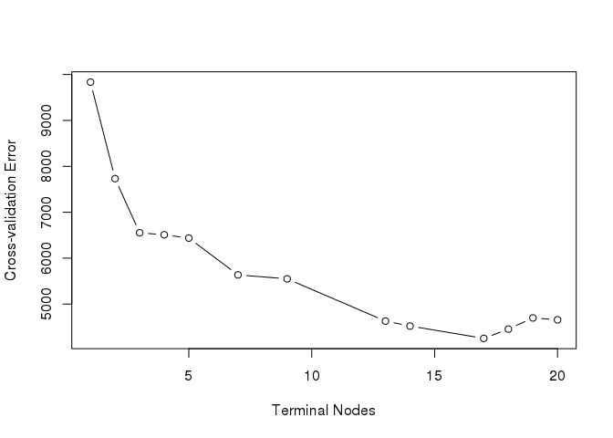
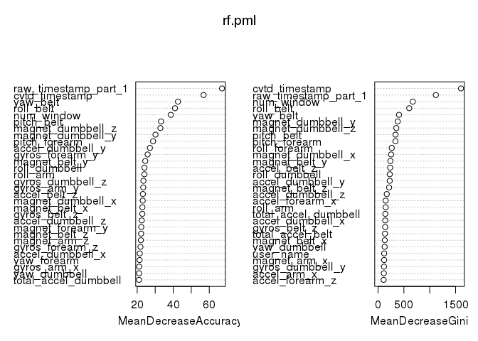

# Practical Machine Learning Project
Benjamin Kariuki  
February 9, 2018  

We load the data and the R packages we will use in this project.

```r
library(tree)
library(randomForest)
```

```
## randomForest 4.6-12
```

```
## Type rfNews() to see new features/changes/bug fixes.
```

```r
har.train <- read.csv("~/pml-training.csv")
nas <- character()
```

The data consists of 19,622 observations of 160 variables. We first look for variables with missing values and the number of missing values per variable.


```r
for(j in seq_along(names(har.train))){
  if(sum(is.na(har.train[j]))>0){
    print(paste(names(har.train[j]), sum(is.na(har.train[j]))))
    nas[j] <- names(har.train[j])
  } 
}
```

```
## [1] "max_roll_belt 19216"
## [1] "max_picth_belt 19216"
## [1] "min_roll_belt 19216"
## [1] "min_pitch_belt 19216"
## [1] "amplitude_roll_belt 19216"
## [1] "amplitude_pitch_belt 19216"
## [1] "var_total_accel_belt 19216"
## [1] "avg_roll_belt 19216"
## [1] "stddev_roll_belt 19216"
## [1] "var_roll_belt 19216"
## [1] "avg_pitch_belt 19216"
## [1] "stddev_pitch_belt 19216"
## [1] "var_pitch_belt 19216"
## [1] "avg_yaw_belt 19216"
## [1] "stddev_yaw_belt 19216"
## [1] "var_yaw_belt 19216"
## [1] "var_accel_arm 19216"
## [1] "avg_roll_arm 19216"
## [1] "stddev_roll_arm 19216"
## [1] "var_roll_arm 19216"
## [1] "avg_pitch_arm 19216"
## [1] "stddev_pitch_arm 19216"
## [1] "var_pitch_arm 19216"
## [1] "avg_yaw_arm 19216"
## [1] "stddev_yaw_arm 19216"
## [1] "var_yaw_arm 19216"
## [1] "max_roll_arm 19216"
## [1] "max_picth_arm 19216"
## [1] "max_yaw_arm 19216"
## [1] "min_roll_arm 19216"
## [1] "min_pitch_arm 19216"
## [1] "min_yaw_arm 19216"
## [1] "amplitude_roll_arm 19216"
## [1] "amplitude_pitch_arm 19216"
## [1] "amplitude_yaw_arm 19216"
## [1] "max_roll_dumbbell 19216"
## [1] "max_picth_dumbbell 19216"
## [1] "min_roll_dumbbell 19216"
## [1] "min_pitch_dumbbell 19216"
## [1] "amplitude_roll_dumbbell 19216"
## [1] "amplitude_pitch_dumbbell 19216"
## [1] "var_accel_dumbbell 19216"
## [1] "avg_roll_dumbbell 19216"
## [1] "stddev_roll_dumbbell 19216"
## [1] "var_roll_dumbbell 19216"
## [1] "avg_pitch_dumbbell 19216"
## [1] "stddev_pitch_dumbbell 19216"
## [1] "var_pitch_dumbbell 19216"
## [1] "avg_yaw_dumbbell 19216"
## [1] "stddev_yaw_dumbbell 19216"
## [1] "var_yaw_dumbbell 19216"
## [1] "max_roll_forearm 19216"
## [1] "max_picth_forearm 19216"
## [1] "min_roll_forearm 19216"
## [1] "min_pitch_forearm 19216"
## [1] "amplitude_roll_forearm 19216"
## [1] "amplitude_pitch_forearm 19216"
## [1] "var_accel_forearm 19216"
## [1] "avg_roll_forearm 19216"
## [1] "stddev_roll_forearm 19216"
## [1] "var_roll_forearm 19216"
## [1] "avg_pitch_forearm 19216"
## [1] "stddev_pitch_forearm 19216"
## [1] "var_pitch_forearm 19216"
## [1] "avg_yaw_forearm 19216"
## [1] "stddev_yaw_forearm 19216"
## [1] "var_yaw_forearm 19216"
```

Each of the variables with missing values has 19,216 missing values. That is, for each of these 67 variables only about 2% of the total number of observations have any values recorded. It is fairly reasonable, therefore, to omit these 67 variables in the model we will use for prediction.


```r
nas1 <- unique((na.omit(nas)))
length(nas1)
```

```
## [1] 67
```

A close look at the remaining 93 variables reveals that there are quite a number of variables with invalid values. The #DIV/0! error is generated by MS Excel when a formula that generates a column involves division of a number by 0. 

```r
pml.train <- har.train
pml.train <- har.train[, -which(names(har.train)%in%nas1)]
str(pml.train)
```

```
## 'data.frame':	19622 obs. of  93 variables:
##  $ X                      : int  1 2 3 4 5 6 7 8 9 10 ...
##  $ user_name              : Factor w/ 6 levels "adelmo","carlitos",..: 2 2 2 2 2 2 2 2 2 2 ...
##  $ raw_timestamp_part_1   : int  1323084231 1323084231 1323084231 1323084232 1323084232 1323084232 1323084232 1323084232 1323084232 1323084232 ...
##  $ raw_timestamp_part_2   : int  788290 808298 820366 120339 196328 304277 368296 440390 484323 484434 ...
##  $ cvtd_timestamp         : Factor w/ 20 levels "02/12/2011 13:32",..: 9 9 9 9 9 9 9 9 9 9 ...
##  $ new_window             : Factor w/ 2 levels "no","yes": 1 1 1 1 1 1 1 1 1 1 ...
##  $ num_window             : int  11 11 11 12 12 12 12 12 12 12 ...
##  $ roll_belt              : num  1.41 1.41 1.42 1.48 1.48 1.45 1.42 1.42 1.43 1.45 ...
##  $ pitch_belt             : num  8.07 8.07 8.07 8.05 8.07 8.06 8.09 8.13 8.16 8.17 ...
##  $ yaw_belt               : num  -94.4 -94.4 -94.4 -94.4 -94.4 -94.4 -94.4 -94.4 -94.4 -94.4 ...
##  $ total_accel_belt       : int  3 3 3 3 3 3 3 3 3 3 ...
##  $ kurtosis_roll_belt     : Factor w/ 397 levels "","-0.016850",..: 1 1 1 1 1 1 1 1 1 1 ...
##  $ kurtosis_picth_belt    : Factor w/ 317 levels "","-0.021887",..: 1 1 1 1 1 1 1 1 1 1 ...
##  $ kurtosis_yaw_belt      : Factor w/ 2 levels "","#DIV/0!": 1 1 1 1 1 1 1 1 1 1 ...
##  $ skewness_roll_belt     : Factor w/ 395 levels "","-0.003095",..: 1 1 1 1 1 1 1 1 1 1 ...
##  $ skewness_roll_belt.1   : Factor w/ 338 levels "","-0.005928",..: 1 1 1 1 1 1 1 1 1 1 ...
##  $ skewness_yaw_belt      : Factor w/ 2 levels "","#DIV/0!": 1 1 1 1 1 1 1 1 1 1 ...
##  $ max_yaw_belt           : Factor w/ 68 levels "","-0.1","-0.2",..: 1 1 1 1 1 1 1 1 1 1 ...
##  $ min_yaw_belt           : Factor w/ 68 levels "","-0.1","-0.2",..: 1 1 1 1 1 1 1 1 1 1 ...
##  $ amplitude_yaw_belt     : Factor w/ 4 levels "","#DIV/0!","0.00",..: 1 1 1 1 1 1 1 1 1 1 ...
##  $ gyros_belt_x           : num  0 0.02 0 0.02 0.02 0.02 0.02 0.02 0.02 0.03 ...
##  $ gyros_belt_y           : num  0 0 0 0 0.02 0 0 0 0 0 ...
##  $ gyros_belt_z           : num  -0.02 -0.02 -0.02 -0.03 -0.02 -0.02 -0.02 -0.02 -0.02 0 ...
##  $ accel_belt_x           : int  -21 -22 -20 -22 -21 -21 -22 -22 -20 -21 ...
##  $ accel_belt_y           : int  4 4 5 3 2 4 3 4 2 4 ...
##  $ accel_belt_z           : int  22 22 23 21 24 21 21 21 24 22 ...
##  $ magnet_belt_x          : int  -3 -7 -2 -6 -6 0 -4 -2 1 -3 ...
##  $ magnet_belt_y          : int  599 608 600 604 600 603 599 603 602 609 ...
##  $ magnet_belt_z          : int  -313 -311 -305 -310 -302 -312 -311 -313 -312 -308 ...
##  $ roll_arm               : num  -128 -128 -128 -128 -128 -128 -128 -128 -128 -128 ...
##  $ pitch_arm              : num  22.5 22.5 22.5 22.1 22.1 22 21.9 21.8 21.7 21.6 ...
##  $ yaw_arm                : num  -161 -161 -161 -161 -161 -161 -161 -161 -161 -161 ...
##  $ total_accel_arm        : int  34 34 34 34 34 34 34 34 34 34 ...
##  $ gyros_arm_x            : num  0 0.02 0.02 0.02 0 0.02 0 0.02 0.02 0.02 ...
##  $ gyros_arm_y            : num  0 -0.02 -0.02 -0.03 -0.03 -0.03 -0.03 -0.02 -0.03 -0.03 ...
##  $ gyros_arm_z            : num  -0.02 -0.02 -0.02 0.02 0 0 0 0 -0.02 -0.02 ...
##  $ accel_arm_x            : int  -288 -290 -289 -289 -289 -289 -289 -289 -288 -288 ...
##  $ accel_arm_y            : int  109 110 110 111 111 111 111 111 109 110 ...
##  $ accel_arm_z            : int  -123 -125 -126 -123 -123 -122 -125 -124 -122 -124 ...
##  $ magnet_arm_x           : int  -368 -369 -368 -372 -374 -369 -373 -372 -369 -376 ...
##  $ magnet_arm_y           : int  337 337 344 344 337 342 336 338 341 334 ...
##  $ magnet_arm_z           : int  516 513 513 512 506 513 509 510 518 516 ...
##  $ kurtosis_roll_arm      : Factor w/ 330 levels "","-0.02438",..: 1 1 1 1 1 1 1 1 1 1 ...
##  $ kurtosis_picth_arm     : Factor w/ 328 levels "","-0.00484",..: 1 1 1 1 1 1 1 1 1 1 ...
##  $ kurtosis_yaw_arm       : Factor w/ 395 levels "","-0.01548",..: 1 1 1 1 1 1 1 1 1 1 ...
##  $ skewness_roll_arm      : Factor w/ 331 levels "","-0.00051",..: 1 1 1 1 1 1 1 1 1 1 ...
##  $ skewness_pitch_arm     : Factor w/ 328 levels "","-0.00184",..: 1 1 1 1 1 1 1 1 1 1 ...
##  $ skewness_yaw_arm       : Factor w/ 395 levels "","-0.00311",..: 1 1 1 1 1 1 1 1 1 1 ...
##  $ roll_dumbbell          : num  13.1 13.1 12.9 13.4 13.4 ...
##  $ pitch_dumbbell         : num  -70.5 -70.6 -70.3 -70.4 -70.4 ...
##  $ yaw_dumbbell           : num  -84.9 -84.7 -85.1 -84.9 -84.9 ...
##  $ kurtosis_roll_dumbbell : Factor w/ 398 levels "","-0.0035","-0.0073",..: 1 1 1 1 1 1 1 1 1 1 ...
##  $ kurtosis_picth_dumbbell: Factor w/ 401 levels "","-0.0163","-0.0233",..: 1 1 1 1 1 1 1 1 1 1 ...
##  $ kurtosis_yaw_dumbbell  : Factor w/ 2 levels "","#DIV/0!": 1 1 1 1 1 1 1 1 1 1 ...
##  $ skewness_roll_dumbbell : Factor w/ 401 levels "","-0.0082","-0.0096",..: 1 1 1 1 1 1 1 1 1 1 ...
##  $ skewness_pitch_dumbbell: Factor w/ 402 levels "","-0.0053","-0.0084",..: 1 1 1 1 1 1 1 1 1 1 ...
##  $ skewness_yaw_dumbbell  : Factor w/ 2 levels "","#DIV/0!": 1 1 1 1 1 1 1 1 1 1 ...
##  $ max_yaw_dumbbell       : Factor w/ 73 levels "","-0.1","-0.2",..: 1 1 1 1 1 1 1 1 1 1 ...
##  $ min_yaw_dumbbell       : Factor w/ 73 levels "","-0.1","-0.2",..: 1 1 1 1 1 1 1 1 1 1 ...
##  $ amplitude_yaw_dumbbell : Factor w/ 3 levels "","#DIV/0!","0.00": 1 1 1 1 1 1 1 1 1 1 ...
##  $ total_accel_dumbbell   : int  37 37 37 37 37 37 37 37 37 37 ...
##  $ gyros_dumbbell_x       : num  0 0 0 0 0 0 0 0 0 0 ...
##  $ gyros_dumbbell_y       : num  -0.02 -0.02 -0.02 -0.02 -0.02 -0.02 -0.02 -0.02 -0.02 -0.02 ...
##  $ gyros_dumbbell_z       : num  0 0 0 -0.02 0 0 0 0 0 0 ...
##  $ accel_dumbbell_x       : int  -234 -233 -232 -232 -233 -234 -232 -234 -232 -235 ...
##  $ accel_dumbbell_y       : int  47 47 46 48 48 48 47 46 47 48 ...
##  $ accel_dumbbell_z       : int  -271 -269 -270 -269 -270 -269 -270 -272 -269 -270 ...
##  $ magnet_dumbbell_x      : int  -559 -555 -561 -552 -554 -558 -551 -555 -549 -558 ...
##  $ magnet_dumbbell_y      : int  293 296 298 303 292 294 295 300 292 291 ...
##  $ magnet_dumbbell_z      : num  -65 -64 -63 -60 -68 -66 -70 -74 -65 -69 ...
##  $ roll_forearm           : num  28.4 28.3 28.3 28.1 28 27.9 27.9 27.8 27.7 27.7 ...
##  $ pitch_forearm          : num  -63.9 -63.9 -63.9 -63.9 -63.9 -63.9 -63.9 -63.8 -63.8 -63.8 ...
##  $ yaw_forearm            : num  -153 -153 -152 -152 -152 -152 -152 -152 -152 -152 ...
##  $ kurtosis_roll_forearm  : Factor w/ 322 levels "","-0.0227","-0.0359",..: 1 1 1 1 1 1 1 1 1 1 ...
##  $ kurtosis_picth_forearm : Factor w/ 323 levels "","-0.0073","-0.0442",..: 1 1 1 1 1 1 1 1 1 1 ...
##  $ kurtosis_yaw_forearm   : Factor w/ 2 levels "","#DIV/0!": 1 1 1 1 1 1 1 1 1 1 ...
##  $ skewness_roll_forearm  : Factor w/ 323 levels "","-0.0004","-0.0013",..: 1 1 1 1 1 1 1 1 1 1 ...
##  $ skewness_pitch_forearm : Factor w/ 319 levels "","-0.0113","-0.0131",..: 1 1 1 1 1 1 1 1 1 1 ...
##  $ skewness_yaw_forearm   : Factor w/ 2 levels "","#DIV/0!": 1 1 1 1 1 1 1 1 1 1 ...
##  $ max_yaw_forearm        : Factor w/ 45 levels "","-0.1","-0.2",..: 1 1 1 1 1 1 1 1 1 1 ...
##  $ min_yaw_forearm        : Factor w/ 45 levels "","-0.1","-0.2",..: 1 1 1 1 1 1 1 1 1 1 ...
##  $ amplitude_yaw_forearm  : Factor w/ 3 levels "","#DIV/0!","0.00": 1 1 1 1 1 1 1 1 1 1 ...
##  $ total_accel_forearm    : int  36 36 36 36 36 36 36 36 36 36 ...
##  $ gyros_forearm_x        : num  0.03 0.02 0.03 0.02 0.02 0.02 0.02 0.02 0.03 0.02 ...
##  $ gyros_forearm_y        : num  0 0 -0.02 -0.02 0 -0.02 0 -0.02 0 0 ...
##  $ gyros_forearm_z        : num  -0.02 -0.02 0 0 -0.02 -0.03 -0.02 0 -0.02 -0.02 ...
##  $ accel_forearm_x        : int  192 192 196 189 189 193 195 193 193 190 ...
##  $ accel_forearm_y        : int  203 203 204 206 206 203 205 205 204 205 ...
##  $ accel_forearm_z        : int  -215 -216 -213 -214 -214 -215 -215 -213 -214 -215 ...
##  $ magnet_forearm_x       : int  -17 -18 -18 -16 -17 -9 -18 -9 -16 -22 ...
##  $ magnet_forearm_y       : num  654 661 658 658 655 660 659 660 653 656 ...
##  $ magnet_forearm_z       : num  476 473 469 469 473 478 470 474 476 473 ...
##  $ classe                 : Factor w/ 5 levels "A","B","C","D",..: 1 1 1 1 1 1 1 1 1 1 ...
```

It is best to eliminate variables with such invalid values as #DIV/0! and empty character values "".


```r
div <- character()

for(j in seq_along(names(pml.train))){
  if(sum(pml.train[j]=="#DIV/0!")){
    print(paste(names(pml.train[j]), sum(pml.train[j]=="#DIV/0!")))
    div[j] <- names(pml.train[j])
  } 
}
```

```
## [1] "kurtosis_roll_belt 10"
## [1] "kurtosis_picth_belt 32"
## [1] "kurtosis_yaw_belt 406"
## [1] "skewness_roll_belt 9"
## [1] "skewness_roll_belt.1 32"
## [1] "skewness_yaw_belt 406"
## [1] "max_yaw_belt 10"
## [1] "min_yaw_belt 10"
## [1] "amplitude_yaw_belt 10"
## [1] "kurtosis_roll_arm 78"
## [1] "kurtosis_picth_arm 80"
## [1] "kurtosis_yaw_arm 11"
## [1] "skewness_roll_arm 77"
## [1] "skewness_pitch_arm 80"
## [1] "skewness_yaw_arm 11"
## [1] "kurtosis_roll_dumbbell 5"
## [1] "kurtosis_picth_dumbbell 2"
## [1] "kurtosis_yaw_dumbbell 406"
## [1] "skewness_roll_dumbbell 4"
## [1] "skewness_pitch_dumbbell 1"
## [1] "skewness_yaw_dumbbell 406"
## [1] "max_yaw_dumbbell 5"
## [1] "min_yaw_dumbbell 5"
## [1] "amplitude_yaw_dumbbell 5"
## [1] "kurtosis_roll_forearm 84"
## [1] "kurtosis_picth_forearm 85"
## [1] "kurtosis_yaw_forearm 406"
## [1] "skewness_roll_forearm 83"
## [1] "skewness_pitch_forearm 85"
## [1] "skewness_yaw_forearm 406"
## [1] "max_yaw_forearm 84"
## [1] "min_yaw_forearm 84"
## [1] "amplitude_yaw_forearm 84"
```

```r
div1 <- unique((na.omit(div)))
pmlFinal.train <- pml.train[, -which(names(pml.train)%in%div1)]
```

We split the data into a training set and a validation set.


```r
set.seed(3843)
inBuild <- sample(1:nrow(pmlFinal.train), .7 * nrow(pmlFinal.train))
buildData <- pmlFinal.train[inBuild, ]
validation <- pmlFinal.train[-inBuild, ]
```

# Model Building

Before we build the predictive model we note that the predictor variable is "classe" and that the variable "X" is simply the id of the observation and as such should not be included in the model.

We first fit a classification tree to the data.

```r
tree.pml <- tree(classe~.-X, buildData)
summary(tree.pml)
```

```
## 
## Classification tree:
## tree(formula = classe ~ . - X, data = buildData)
## Variables actually used in tree construction:
##  [1] "cvtd_timestamp"       "num_window"           "raw_timestamp_part_1"
##  [4] "roll_belt"            "magnet_dumbbell_z"    "accel_dumbbell_y"    
##  [7] "pitch_belt"           "roll_dumbbell"        "accel_belt_z"        
## [10] "accel_forearm_x"     
## Number of terminal nodes:  20 
## Residual mean deviance:  0.5198 = 7129 / 13720 
## Misclassification error rate: 0.09327 = 1281 / 13735
```

If we use this classification tree to predict the values of "classe" in the validation set, we obtain a misclassification error rate of about 26%.


```r
tree.pred <- predict(tree.pml, newdata = validation, type = "class")
table(tree.pred, validation$classe)
```

```
##          
## tree.pred    A    B    C    D    E
##         A 1530  248   10    6    0
##         B  127  535  292  121    0
##         C   23  329  581   65    2
##         D    0    6    6  705  131
##         E    0    0   91   94  985
```

```r
mean(tree.pred!=validation$classe)
```

```
## [1] 0.2634619
```

We now consider whether pruning the tree might lead to improved results. We use cross-validation to determine the optimal level of tree complexity.

```r
set.seed(3843)
cv.pml <- cv.tree(tree.pml, FUN=prune.misclass)
cbind(cv.pml$size, cv.pml$dev)
```

```
##       [,1] [,2]
##  [1,]   20 4657
##  [2,]   19 4698
##  [3,]   18 4455
##  [4,]   17 4252
##  [5,]   14 4521
##  [6,]   13 4629
##  [7,]    9 5549
##  [8,]    7 5635
##  [9,]    5 6437
## [10,]    4 6509
## [11,]    3 6552
## [12,]    2 7732
## [13,]    1 9835
```

```r
plot(cv.pml$size, cv.pml$dev, type = 'b', xlab = "Terminal Nodes", ylab = "Cross-validation Error")
```

<!-- -->

The tree with 17 terminal nodes results in the lowest cross-validation error rate, with 4,252 cross-validation errors.

We prune the original tree to obtain the 17-node tree


```r
prune.pml <- prune.misclass(tree.pml, best = 17)
summary(prune.pml)
```

```
## 
## Classification tree:
## snip.tree(tree = tree.pml, nodes = c(46L, 12L, 19L))
## Variables actually used in tree construction:
##  [1] "cvtd_timestamp"       "num_window"           "raw_timestamp_part_1"
##  [4] "roll_belt"            "magnet_dumbbell_z"    "accel_dumbbell_y"    
##  [7] "pitch_belt"           "roll_dumbbell"        "accel_belt_z"        
## [10] "accel_forearm_x"     
## Number of terminal nodes:  17 
## Residual mean deviance:  0.6538 = 8969 / 13720 
## Misclassification error rate: 0.1141 = 1567 / 13735
```

The pruned to tree leads to a slight reduction in the misclassification error rate in the validation set down to about 24%.


```r
tree.pred <- predict(prune.pml, newdata = validation, type = "class")
table(tree.pred, validation$classe)
```

```
##          
## tree.pred    A    B    C    D    E
##         A 1530  248   10    6    0
##         B  149  685  335  121    0
##         C    1  179  623   74   45
##         D    0    6    6  705  131
##         E    0    0    6   85  942
```

```r
mean(tree.pred!=validation$classe)
```

```
## [1] 0.2381519
```

We try more complex model building methods in an attempt to improve prediction accuracy.

Applying bagging to our data, we provide the argument mtry = 58 to indicate that all 58 predictor variables should be considered for each split of the tree.


```r
set.seed(3843)
bag.pml <- randomForest(classe~.-X, data = buildData, mtry = 58, importance = TRUE)
bag.pml
```

```
## 
## Call:
##  randomForest(formula = classe ~ . - X, data = buildData, mtry = 58,      importance = TRUE) 
##                Type of random forest: classification
##                      Number of trees: 500
## No. of variables tried at each split: 58
## 
##         OOB estimate of  error rate: 0.15%
## Confusion matrix:
##      A    B    C    D    E class.error
## A 3900    0    0    0    0 0.000000000
## B    1 2675    3    0    0 0.001493094
## C    0    2 2438    2    0 0.001638002
## D    0    0    7 2216    2 0.004044944
## E    0    0    0    4 2485 0.001607071
```

The bagged model leads to a significant reduction in the misclassification error rate in the validation set as compared to classification trees. It comes down to about 0.1%


```r
yhat.bag <- predict(bag.pml, newdata = validation)
table(yhat.bag, validation$classe)
```

```
##         
## yhat.bag    A    B    C    D    E
##        A 1680    0    0    0    0
##        B    0 1115    1    0    0
##        C    0    3  979    0    0
##        D    0    0    0  990    2
##        E    0    0    0    1 1116
```

```r
mean(yhat.bag!=validation$classe)
```

```
## [1] 0.001189061
```

The random forests model leads to an even better performance in the validation set with a misclassification error rate of about 0.08%.


```r
set.seed(3843)
rf.pml <- randomForest(classe~.-X, data = buildData, importance = TRUE)
rf.pml
```

```
## 
## Call:
##  randomForest(formula = classe ~ . - X, data = buildData, importance = TRUE) 
##                Type of random forest: classification
##                      Number of trees: 500
## No. of variables tried at each split: 7
## 
##         OOB estimate of  error rate: 0.1%
## Confusion matrix:
##      A    B    C    D    E  class.error
## A 3900    0    0    0    0 0.0000000000
## B    1 2678    0    0    0 0.0003732736
## C    0    2 2438    2    0 0.0016380016
## D    0    0    4 2219    2 0.0026966292
## E    0    0    0    3 2486 0.0012053033
```

```r
yhat.rf <- predict(rf.pml, newdata = validation)
table(yhat.rf, validation$classe)
```

```
##        
## yhat.rf    A    B    C    D    E
##       A 1679    1    0    0    0
##       B    1 1117    1    0    0
##       C    0    0  979    0    0
##       D    0    0    0  991    2
##       E    0    0    0    0 1116
```

```r
mean(yhat.rf!=validation$classe)
```

```
## [1] 0.000849329
```

A variable importance plot indicates that across all of the trees considered in the random forest, besides the variables representing time, the acceleromators on the belt at Euler angles roll and yaw were most important in correctly determining whether the  dumbbell exercises were performed exactly according to the specification (Class A) or 4 other common mistakes were made (Classes B to E) while performing the exercises.


```r
varImpPlot(rf.pml)
```

<!-- -->
